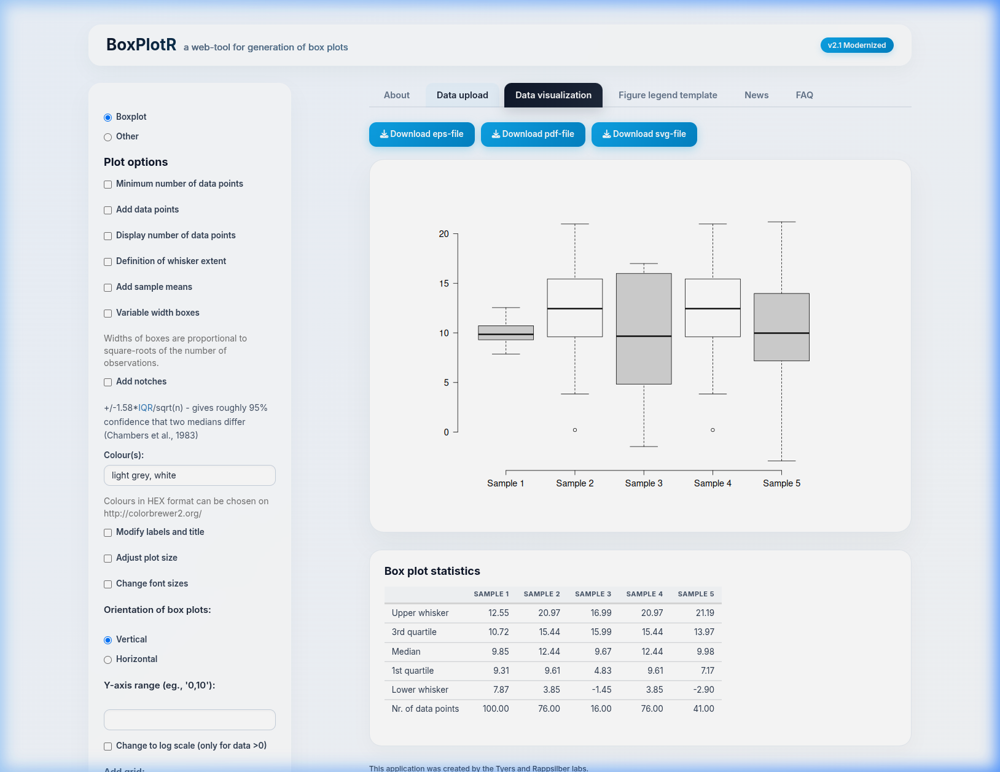

# BoxPlotR

[](https://www.r-project.org/)
[](https://shiny.posit.co/)
[](https://hub.docker.com/r/rocker/shiny)

This is the repository for the Shiny application presented in **"BoxPlotR: a web tool for generation of box plots"** (Spitzer et al. 2014).



Installation and Run Options
----------------------------

### 1) Run Natively via Docker (Recommended Isolated Deployment)

Deploy the fully-configured modern version natively without installing R dependencies directly onto your host system:

```bash
# Build the Docker image
docker build -t boxplotr:latest .

# Run the container (maps the container server to port 3838)
docker run -d -p 3838:3838 boxplotr:latest
```
Access the application in your web browser at: `http://localhost:3838`

### 2) Running the Isolated Test Suite
The container comes equipped with `testthat` to run the project's automated test suite inside the same isolated sandbox:

```bash
docker run --rm boxplotr:latest Rscript -e "library(testthat); test_dir('/srv/shiny-server/tests')"
```

---

### 3) Launch Natively from R and GitHub

Before running natively, ensure you have the latest versions of R and RStudio installed:

1. Launch R / RStudio Console.
2. Install the necessary packages:
   ```R
   install.packages(c("shiny", "beeswarm", "vioplot", "beanplot", "RColorBrewer", "readxl", "sm", "testthat"))
   ```
3. Start the application directly:
   ```R
   shiny::runGitHub("BoxPlotR.shiny", "jwildenhain")
   ```

---

### 4) Install Natively on Shiny Server

To run BoxPlotR as a service on a dedicated Linux host (e.g. Ubuntu):

1. Install Shiny Server system dependencies:
   ```bash
   sudo apt-get update
   sudo apt-get install gdebi-core R-base
   ```
2. Download and install POSIT's Shiny Server from [posit.co/download/shiny-server/](https://posit.co/download/shiny-server/).
3. Pull the BoxPlotR repository into your Shiny server apps directory (e.g., `/srv/shiny-server/` or your custom `SHINY_APP_HOME`).
4. Install all required R packages system-wide:
   ```bash
   sudo R -e 'install.packages(c("shiny", "beeswarm", "vioplot", "beanplot", "RColorBrewer", "readxl", "sm"), repos="https://cloud.r-project.org/")'
   ```
5. Restart the server service:
   ```bash
   sudo systemctl restart shiny-server
   ```

---

### 5) Model Context Protocol (MCP) Server Integration

This repository includes a native, stdio-compliant **Model Context Protocol (MCP) server** (`boxplotr_mcp_server.py`) written in Python with no external library dependencies. It allows large language models (LLMs) to call BoxPlotR's plotting engine directly via standard JSON-RPC tools!

#### Running the MCP Server Natively
Make sure you have `Python 3` and `Rscript` installed on your machine:
```bash
./boxplotr_mcp_server.py
```

#### Integrating with Claude Desktop / LLM Clients
To configure the BoxPlotR MCP Server in Claude Desktop, add the following entry to your `claude_desktop_config.json` (usually located at `~/.config/Claude/claude_desktop_config.json` on Linux/macOS or `%APPDATA%/Claude/claude_desktop_config.json` on Windows):

```json
{
  "mcpServers": {
    "boxplotr": {
      "command": "python3",
      "args": ["/home/jw/Source/BoxPlotR.shiny/boxplotr_mcp_server.py"]
    }
  }
}
```

Once integrated, any LLM configured with MCP can generate publication-grade box plots, violin plots, and bean plots automatically by processing user commands and passing data directly to BoxPlotR!

